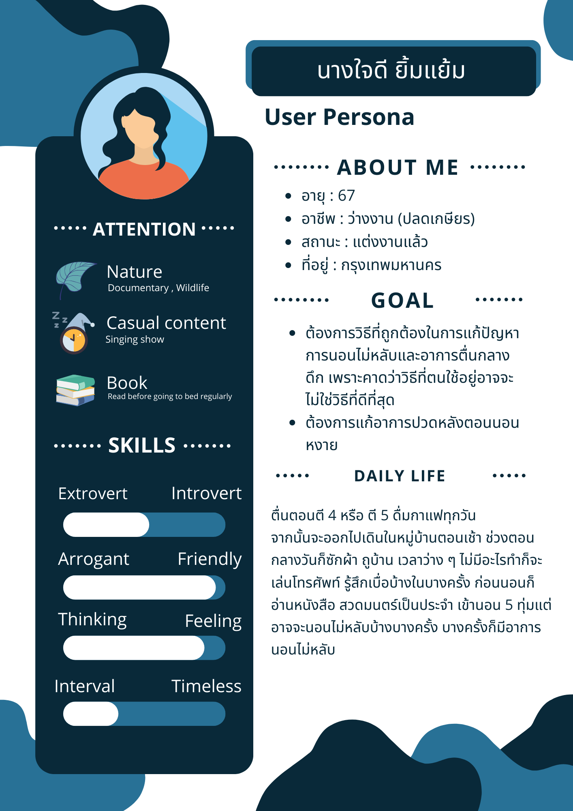

# ปัญหาด้านการนอนหลับ
# Emphathize
### Interview script
### What-how-why
### Say-do-think-feel :zzz:
 คำพูด-การกระทำ-ความคิด-ความรู้สึก ของผู้ใช้
### say :point_left:
> นางใจดีบอกว่านอนหงายเพราะว่าเป็นคนน้ำหนักตัวเยอะ ถ้านอนตะแคงเส้นมันจะกดทับ
### do :grey_question:
> เธอเลยนอนหงายเพราะว่าเป็นคนน้ำหนักตัวเยอะ 
### think :thought_balloon:
> นางใจดีมองว่าการนอนหงายทําให้นางใจดีนั้นนอนได้ง่าย **เลยต้องการท่านอนที่ดีเพื่อให้นอนได้สบายขึ้น**
### feel :eyes:
> นางใจดีนั้นนอนแล้วรู้สึกสบายขึ้น นอนหลับได้ดี ไม่มีอะไรมากวนใจหรือไม่สบาย 

บันทึกโดย **_ก้องภพ_**

# Define
### Journey map
### User persona

บันทึกโดย *อั้ม*

### Identified insights :flags:
- Need
> มีความต้องการที่จะนอนหลับสบาย อยากจะแก้ปัญหาการนอนไม่หลับ แต่คาดว่าที่ตัวเองทำอาจไม่ใช่วิธีที่ดีที่สุด
- Insight
> นางใจดีพยายามทำให้ตัวเองสุขภาพดีเท่าที่ตัวเองทำได้ แต่ก็ยังมีปัญหานอนไม่หลับ อาจจะแก้ปัญหาเรื่องสภาพแวดล้อมแทน  

บันทึกโดย *พิณงาม*
### PoV statement
มุมมองของผู้สัมภาษณ์

**1. We met : นางใจดี ยิ้มแย้ม ผู้สูงอายุวัย 67 ปี**

**2. We were Surprised to notice : นางใจดีไม่ค่อยมีปัญหาในการนอนหลับทั้งที่มีอายุค่อยข้างสูง**

**3. We wonder if this means : นางใจดีมีเวลานอนที่ค่อนข้างตายตัวและยังมีการออกกำลังกายเป็นประจำทุกๆเช้า รวมถึงมีท่านอนที่ใช้เป็นประจำคือการนอนหงายเพราะว่าป้าเป็นคนน้ำหนักตัวเยอะ ตะแคงมันจะกดทับ และหายใจไม่คล่อง ทำให้ไม่มีปัญหาในการนอนไม่หลับ** 

**4. it would be game-changing to : ทำให้มีสุขภาพดีเนื่องจากสามารถนอนได้เต็มเวลา** 

บันทึกโดย **_ชนกานต์_**
