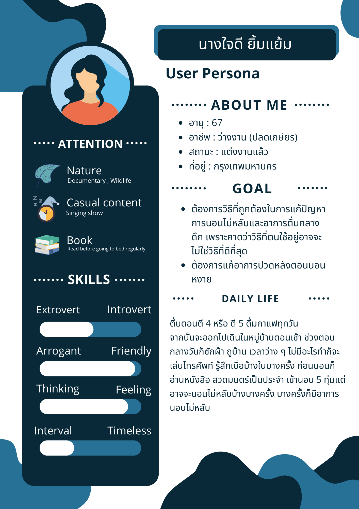

# ปัญหาด้านการนอนหลับ
# Emphathize
### Interview script :microphone:

#### ข้อมูลทั่วไป :bookmark_tabs:

### นางใจดี ยิ้มแย้ม ###

1. **อายุเท่าไร**   
    - 67
2. **ปัจจุบันทำงานอาชีพอะไร**   
    - ไม่ได้ทำอะไร ปลดเกษียรแล้ว
3. **ปัจจุบันอยู่อาศัยกันกี่คน (รวมตัวเองด้วย)**    
    - 3 คน
4. **กิจกรรมยามว่าง**
    - ทำงานบ้าน
5. **อาหารชอบ** 
    - ข้าวและกับข้าว พวกข้าวราดแกง
6. **มีความสนใจในเรื่องไหนมากที่สุด**  
    - สนใจในเรื่องความสบายๆ อย่างตอนดูทีวี จะดูพวกธรรมชาติ สารคดี

#### ชีวิตประจำวัน :incoming_envelope:

7. **กิจกรรมที่ทำในชีวิตประจำวัน**
    - ตื่นตอนตี 5 ซักผ้าตอนเช้า ถูบ้านตอนบ่ายๆ นั่งเล่นโทรศัพท์ บางครั้งก็รู้สึกเบื่อบ้างในบางครั้ง

#### เวลาการนอน :clock1:

8. **โดยรวมแล้วนอนวันละกี่ชั่วโมง**  
    - ประมาณ 7 ชม
10. **เข้านอน-ตื่นกี่โมง**  
    - เข้านอน 4ทุ่ม  ตื่น ตี5
11. **มีตื่นกลางดึกบ้างมั้ย**  
    - มี 5 ทุ่ม เที่ยงคืนบ้าง เพราะว่าบางคืนก็นอนไม่หลับ

#### พฤติกรรมการนอน :sleeping: 

12. **เวลานอนนอนท่าไหน**
    - นอนหงายเพราะว่าป้าเป็นคนน้ำหนักตัวเยอะ ถ้านอนตะแคงมันจะกดทับ และหายใจไม่คล่อง
13. **ปกตินอนกลางวันด้วยไหม**
    - ไม่หลับ
14. **กิจกรรมก่อนนอนได้ทำอะไรบ้าง**
    - สวดมนต์ อ่านหนังสือ
15. **ปกติแล้วได้ออกกําลังกายบ่อยมั้ย**
    - ออกไปเดินในหมู่บ้านตอนเช้า

#### อาหารการกิน :fork_and_knife:

16. **กินก่อนนอนไหม**
    - ไม่แล้ว ไม่กินหลัง 6 โมงเย็นไปแล้ว
17. **ดื่มกาแฟไหม**
    - ดื่มกาแฟทุกวันตอนเช้า
18. **จริงหรือที่อาหารบางอย่างช่วยทำให้หลับได้ดีขึ้น**
    - ไม่เลย คิดว่ามันจะทำให้หลับยากขึ้น
19. **ดื่มแอลกอฮอลล์หรือเปล่า**
    - ไม่เลย

#### ปัจจัยการนอน :cyclone:

20. **มีปัญหาด้านการนอนที่อยากแก้ไหม**
    - นอนไม่หลับ
21. **เป็นบ่อยขนาดไหน**
    - เกิดขึ้นแค่บางวัน
22. **อย่างไร**
    - หลังจากขึ้นนอนสี่ทุ่มก็นอนโดยไม่หลับจนทำให้นอนดึกขึ้น
23. **ปกติแล้วแก้ปัญหายังไง**
    - พลิกไปพลิกมา
    - ดูโทรศัพท์
24. **ทำไมทำอย่างนั้น**
    - เพราะว่าตาจะได้ล้าแล้วหลับเลย
25. **คิดว่าเป็นวิธีที่แก้ปัญหาที่ดีที่สุดแล้วมั้ย**
    - น่าจะใช่นะ
26. **คิดว่าอะไรที่มีผลต่อการนอนหลับ**
    - น่าจะเป็น โรค อายุ
27. **มีโรคประจำตัวไหม**
    - ความดัน
    - ไขมันในเลือด
    - ไทรอย

### นางโครเซต์ ไหมไทย ###

1. **อายุเท่าไร**   
    - 62
2. **ปัจจุบันทำงานอาชีพอะไร**   
    - ช่างทำผม
3. **ปัจจุบันอยู่อาศัยกันกี่คน (รวมตัวเองด้วย)**    
    - อาศัยอยู่คนเดียว
4. **กิจกรรมยามว่าง**
    - ทำงานฝีมือ ถักโครเชต์
5. **อาหารชอบ** 
    - ผักกับน้ำพริก
6. **มีความสนใจในเรื่องไหนมากที่สุด**  
    - สนใจข่าวสารทุกเรื่อง

#### ชีวิตประจำวัน :incoming_envelope:

7. **กิจกรรมที่ทำในชีวิตประจำวัน**
    - ตื่นแปดโมง อาบน้ำกินข้าว เปิดร้าน บริการลูกค้า หากไม่มีลูกค้าก็จะ อ่านหนังสือ ดูข่าว ถักโครเชต์ นอนประมาณตีหนึ่ง แต่นอนไม่เต็มที่ ตื่นเป็นช่วงๆ

#### เวลาการนอน :clock1:

8. **โดยรวมแล้วนอนวันละกี่ชั่วโมง**  
    - ประมาณ 4-7 ชั่วโมง (แล้วแต่ว่าตื่นกลางดึกมั้ย)
10. **เข้านอน-ตื่นกี่โมง**  
    - เข้านอนตีหนึ่ง ตื่นแปดโมง
11. **มีตื่นกลางดึกบ้างมั้ย**  
    - ตื่นทุกๆสามชั่วโมง แล้วจะหลับประมาณสองชั่วโมง

#### พฤติกรรมการนอน :sleeping: 

12. **เวลานอนนอนท่าไหน**
    - นอนทุกท่า แต่ไม่นอนคว่ำ
13. **ปกตินอนกลางวันด้วยไหม**
    - ไม่นอนกลางวัน เป็นคนที่ไม่ง่วงเวลากลางวัน
14. **กิจกรรมก่อนนอนได้ทำอะไรบ้าง**
    - ดูยูทูป ดูทุกอย่าง สารคดี podcast
15. **ปกติแล้วได้ออกกําลังกายบ่อยมั้ย**
    - ออกกำลังกายอาทิตย์ละสี่วัน โดยประมาณ

#### อาหารการกิน :fork_and_knife:

16. **กินก่อนนอนไหม**
    - ไม่กินก่อนนอน กิมมื้อเย็นก่อนหกโมงเย็น ก่อนนอนจะดื่มแค่น้ำเปล่า
17. **ดื่มกาแฟไหม**
    - ดื่มกาแฟทุกวัน หลังอาหารกลางวัน วันละหนึ่งแก้ว
18. **จริงหรือที่อาหารบางอย่างช่วยทำให้หลับได้ดีขึ้น**
    - จริง เพราะว่าเคยลองอ่านข่าวว่า ลองกินน้ำผึ้งแล้วจะช่วยให้หลับง่ายขึ้น
19. **ดื่มแอลกอฮอลล์หรือเปล่า**
    - ไม่ดื่มเลย ไม่สูบบุหรี่ด้วย

#### ปัจจัยการนอน :cyclone:

20. **มีปัญหาด้านการนอนที่อยากแก้ไหม**
    - นอนหลับๆตื่นๆ
21. **เป็นบ่อยขนาดไหน**
    - เป็นทุกวัน
22. **อย่างไร**
    - ตื่นช่วงกลางดึก ทุกๆสามชั่วโมง
23. **ปกติแล้วแก้ปัญหายังไง**
    - ดูยูทูป
    - ดูโทรศัพท์
24. **ทำไมทำอย่างนั้น**
    - เพราะนอนไม่หลับ เลยไม่รู้จะทำอะไร เลยดูยูทูป ทำให้ตัวเองง่วง และหลับต่อได้
25. **คิดว่าเป็นวิธีที่แก้ปัญหาที่ดีที่สุดแล้วมั้ย**
    - ไม่สามารถเจาะจงได้ เพราะแต่ละคนมีวิธีแก้ปัญหาไม่เหมือนกัน บางคนตื่นมาสวดมนต์
26. **คิดว่าอะไรที่มีผลต่อการนอนหลับ**
    - ตวามเครียด บางทีความเครียดก็ทำให้นอนไม่หลับ
27. **มีโรคประจำตัวไหม**
    - ไม่มีโรคประจำตัว

### What-how-why

**กิจกรรมจากการสัมภาษณ์**  
1.บทสัมภาษณ์ของ _นางใจดี ยิ้มแย่ม_
 | What | How | Why |
 | ---- | --- | --- |
 | ตื่นตีสี่-ตีห้า | รู้สึกเหนื่อยล้า งัวเงีย | เพราะอาการนอนไม่หลับ |
 | ดื่มกาแฟ | รู้สึกมีพลังงานเพิ่มขึ้น | ได้รับคาเฟอีนจากกาแฟ |
 | เดินเล่น | รู้สึกสดชื่น | เพราะได้ออกกำลังกายและได้สูดอากาศยามเช้า |
 | ทำงานบ้าน | รู้สึกเหนื่อย | เพราะทำงานบ้านหลายอย่างตั้งแต่ กวาดบ้าน ถูบ้าน และ ซักผ้า |
 | อ่านหนังสือ , สวดมนต์ | รู้สึกจิตใจสงบ เข้าสู่ธรรมะ | ได้อ่านหนังสือและมีสมาธิในการอ่านหนังสือ ได้อ่านเกี่ยวกับธรรมะ |
 | เข้านอน 5 ทุ่ม | รู้สึกได้พักผ่อนจากความเหนื่อยล้า | ได้นอนพักผ่อน ผ่อนคลายจากความเหนื่อยล้า |

2.บทสัมภาษณ์ของ _นางโครเซต์ ไหมไทย_

 | What | How | Why |
 | ---- | --- | --- |
 | ตื่นนอน | รู้สึกเหนื่อยล้า | เพราะอาการนอนไม่หลับ |
 | กินข้าวเช้า | รู้สึกได้พลังงาน | ได้ทานอาหารเช้า |
 | เปิดร้านทำผม | รู้สึกพร้อมกับการทำงาน | เพราะได้รับประทานอาหารเช้าเรียบร้อย |
 | กินข้าวเที่ยง | รู้สึกได้พลังงานจากการกินข้าว | เพราะได้ทานอาหารหลังจาก พักจากร้านทำผม |
 | ดื่มกาแฟ | รู้สึกตื่นตัว | ได้ดื่มกาแฟหลังอาหารเที่ยง |
 | ถักโครเชต์ | รู้สึกสงบ | ได้มีสมาธิกับการถักโครเชต์ |
 | กินข้าวเย็น | รู้สึกอิ่มท้อง | ได้ทานอาหารเพิ่มพลังงาน |
 | เข้านอน | รู้สึกผ่อนคลาย | ได้นอนพักผ่อนจากความเหนื่อยล้าทั้งวัน |

บันทึกโดย **_โอม_**
### Say-do-think-feel :zzz:
 คำพูด-การกระทำ-ความคิด-ความรู้สึก ของผู้ใช้
### say :point_left:
> ทั้งสองคนบอกว่านอนไม่หลับชอบหลับๆตื่นๆจิตใจไม่สงบนิ่ง ถ้ามีเรื่องคิดจะนอนไม่ค่อยหลับ
### do :grey_question:
> ทั้งสองคนเลยเลือกที่จะหาอะไรฟังที่ทําให้จิตใจสงบนิ่งเพราะนอนไม่ค่อยหลับ
### think :thought_balloon:
> ทั้งสองคนมองว่าการฟังธรรมะนั้นทําให้ทั้งสองนั้นนอนไม่หลับๆตื่นและจิตใจสงบนิ่ง **เลยต้องการฟังธรรมะและหาเว็บในการฟังเพื่อให้ได้นอนหลับสบายๆ**
### feel :eyes:
> ทั้งสองคนนั้นนอนแล้วรู้สึกหลับสบายขึ้น นอนหลับดี ไม่มีอะไรมากวนใจหรือไม่สบายใจ

บันทึกโดย **_ก้องภพ_**

# Define
### Journey map
#### นางใจดี ยิ้มแย้ม

#### นางโครเชต์ ไหมไทย

บันทึกโดย **_บูม_**
### User persona

บันทึกโดย **_อั้ม_**

### Identified insights :flags:
- Need
> ทั้งสองคนมีความต้องการที่จะนอนหลับสบาย อยากจะแก้ปัญหาการนอนไม่หลับ นอนแล้วตื่นกลางดึก และคาดว่าที่ตัวเองทำอาจไม่ใช่วิธีที่ดีที่สุด
- Insight
> ทั้งสองคนพยายามทำให้ตัวเองสุขภาพดีเท่าที่ตัวเองทำได้โดยมีการออกกำกายบ้าง แต่ก็ยังมีปัญหานอนไม่หลับ อาจจะแก้ปัญหาเรื่องสภาพแวดล้อมและพฤติกรรมอื่นๆ

บันทึกโดย **_พิณงาม_**

### PoV statement
มุมมองของผู้สัมภาษณ์

**1. We met : นางใจดี ยิ้มแย้ม ผู้สูงอายุวัย 67 ปี**

**2. We were Surprised to notice : นางใจดีไม่ค่อยมีปัญหาในการนอนหลับทั้งที่มีอายุค่อยข้างสูง**

**3. We wonder if this means : นางใจดีมีเวลานอนที่ค่อนข้างตายตัวและยังมีการออกกำลังกายเป็นประจำทุกๆเช้า รวมถึงมีท่านอนที่ใช้เป็นประจำคือการนอนหงายเพราะว่าป้าเป็นคนน้ำหนักตัวเยอะ ตะแคงมันจะกดทับ และหายใจไม่คล่อง ทำให้ไม่มีปัญหาในการนอนไม่หลับ** 

**4. it would be game-changing to : ทำให้มีสุขภาพดีเนื่องจากสามารถนอนได้เต็มเวลา** 

มุมมองของผู้สัมภาษณ์

**1. We met : นางโครเซนต์ ไหมไทย ผู้สูงอายุวัย 67 ปี**

**2. We were Surprised to notice : นางใจดีไม่ค่อยมีปัญหาในการนอนหลับทั้งที่มีอายุค่อยข้างสูง**

**3. We wonder if this means : นางใจดีมีเวลานอนที่ค่อนข้างตายตัวและยังมีการออกกำลังกายเป็นประจำทุกๆเช้า ยังมีการฟังธรรมะที่ทำให้ผ่อนคลายตอนกลางคืน เปิดคลอไปทำให้หลับได้ง่ายขึ้น** 

**4. it would be game-changing to : ทำให้มีสุขภาพดีเนื่องจากสามารถนอนได้เต็มเวลา** 

บันทึกโดย **_ชนกานต์_**

# Ideate
### แบ่งหมวดหมู่ไอเดีย
> ได้ 4 หมวดคือ Rational Chice, Delight, Darling, Long-Shot กลุ่มเราได้ระดมสมองไอเดียต่างๆผ่านเว็บไซต์ canva จนได้มาตามภาพที่เห็นด้านล่าง 
 

 
#### โดยสรุปทางกลุ่มได้พิจารณาและตัดสินใจทำ *แพลตฟอร์มที่รวบรวมเสียงเพื่อให้นอนหลับ* 

# Phototype 

### Test Script
> เมื่อเริ่มเข้านอนแล้วนอนไม่หลับขึ้นมา แล้วเปิดโทรศัพท์ขึ้นมาให้ลองเข้าเว็บที่เราสร้างขึ้น แล้วเลื่อนดูบทสวดที่ต้องการฟัง แล้วกดที่ปุ่ม"กดที่นี้"เพื่อฟังบทธรรมะ ทำให้รู้สึกดีก่อนนอน และรู้สึกเคลิ้มๆจากการฟัง
จนพลอยหลับไปได้ดี

# Test
### Feedback

### สิ่งที่จะนำไปปรับปรุงต่อไป
> ปรับโทนสีให้สบายตา
> เพิ่มขนาดฟ้อนให้อ่านง่ายขึ้น ฟ้อนต้องไม่ลายตา
> เพิ่มเนื้อหาอื่นๆนอกจากบทสวด เช่น เพลงสบายๆ
